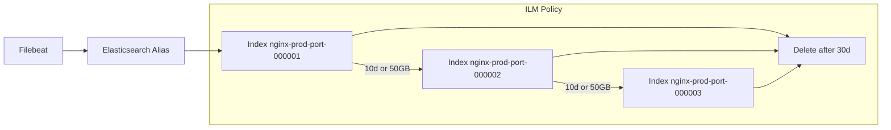
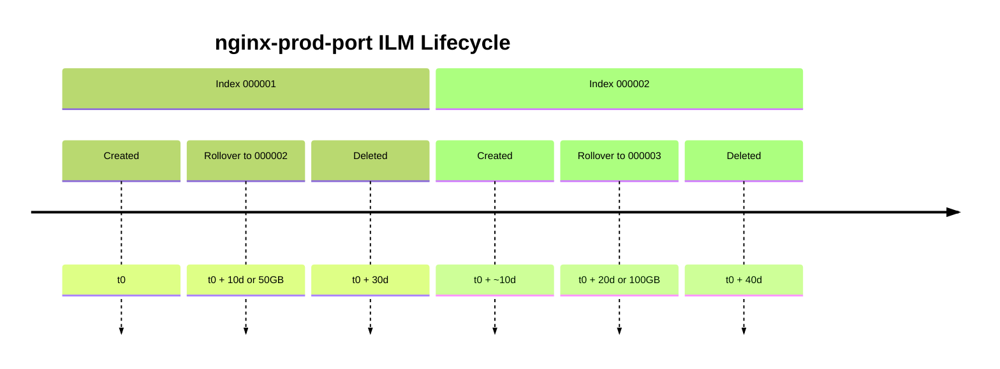

# 📝 NGINX Logs Ingestion with Filebeat + Elasticsearch ILM Rollover

This document outlines how to set up **Filebeat → Elasticsearch** with **ILM + rollover** for scalable and manageable NGINX log ingestion.

---

## 📦 Components

- **Filebeat**: Collects NGINX logs from disk
- **Elasticsearch**: Stores logs, manages lifecycle
- **ILM** (Index Lifecycle Management): Automatically rolls over and deletes old indices
- **Kibana**: UI for monitoring, verification

---

## 🔁 High-Level Workflow





1️⃣ Filebeat Configuration
```
- type: filestream
  id: "port-logs-combined"
  enabled: true
  paths:
    - /var/log/nginx/port-logs/combined/*.log
  index: "nginx-prod-port"   # Alias name
  fields:
    env: "all"
  fields_under_root: true
```
✅ This makes Filebeat write to an alias, not a fixed index.

2️⃣ Elasticsearch ILM Setup


✅ ILM Policy (Only once)
Create a lifecycle policy named nginx-rollover-policy:
```
PUT _ilm/policy/nginx-rollover-policy
{
  "policy": {
    "phases": {
      "hot": {
        "actions": {
          "rollover": {
            "max_age": "10d",
            "max_size": "50gb"
          }
        }
      },
      "delete": {
        "min_age": "30d",
        "actions": {
          "delete": {}
        }
      }
    }
  }
}
```

### Index Template(s)

```
PUT _index_template/nginx-prod-all-template
{
  "index_patterns": ["nginx-prod-all-*"],
  "template": {
    "settings": {
      "index.lifecycle.name": "nginx-prod-rollover-10-30",
      "index.lifecycle.rollover_alias": "nginx-prod-all"
    },
    "aliases": {
      "nginx-prod-all": {
        "is_write_index": true
      }
    }
  },
  "priority": 500
}

PUT _index_template/nginx-prod-port-combined-template
{
  "index_patterns": ["nginx-prod-port-combined-*"],
  "template": {
    "settings": {
      "index.lifecycle.name": "nginx-prod-rollover-10-30",
      "index.lifecycle.rollover_alias": "nginx-prod-port-combined"
    },
    "aliases": {
      "nginx-prod-port-combined": {
        "is_write_index": true
      }
    }
  },
  "priority": 500
}
```

### Create First concrete indexes pointing to aliases

```
PUT /nginx-prod-all-000001
{
  "aliases": {
    "nginx-prod-all": {
      "is_write_index": true
    }
  }
}

PUT /nginx-prod-port-combined-000001
{
  "aliases": {
    "nginx-prod-port-combined": {
      "is_write_index": true
    }
  }
}
```
✅ Benefits

🔁 Automated rollover prevents index bloat

📉 Old indices are deleted after 30 days

🔍 Efficient querying via small, time-scoped indices

🛠️ Easy to add more log types (e.g. nginx-prod-api) via script
